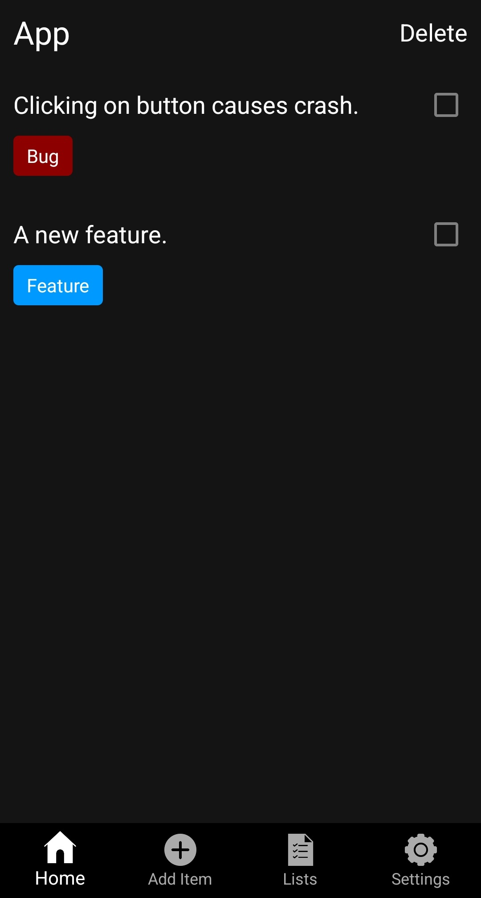
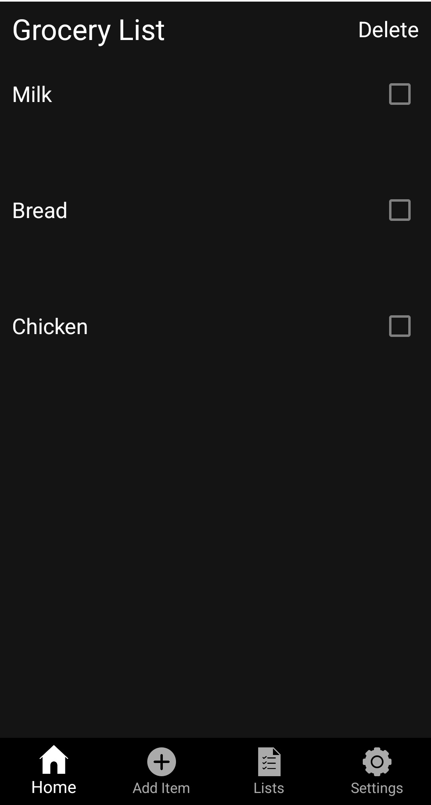
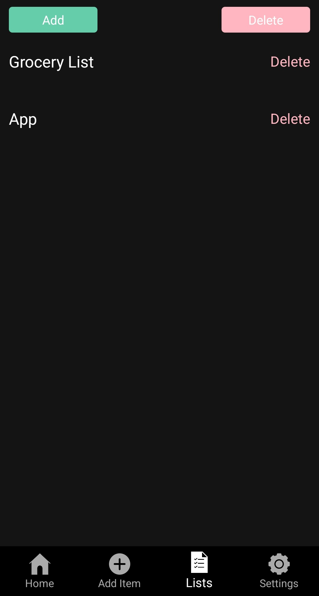
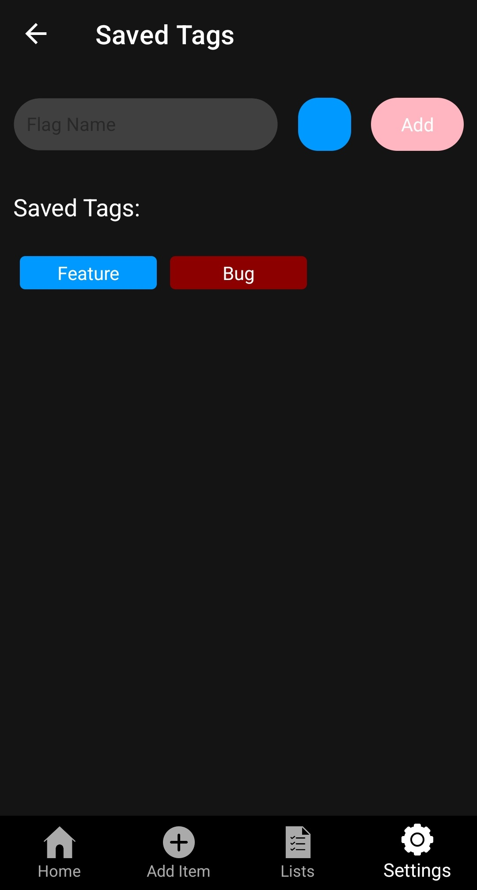
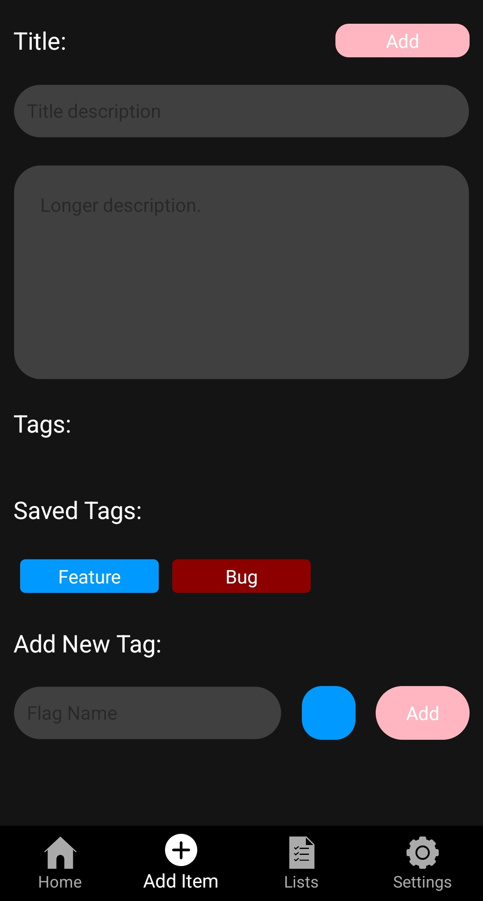

# Ergie

Ergie is a power-oriented to-do app created in C# with .NET MAUI. It allows for the ability to create simple and detailed to-do lists that include descriptions and user defined tags.

### Current Features
- Multiple lists.
- User defined Tags with custom color, and the ability to save them for more efficient use later.
- Light & Dark themes

### Planned features
- Item sorting by tags.
- Item filtering by tags.
- Swipe to delete/complete items.

